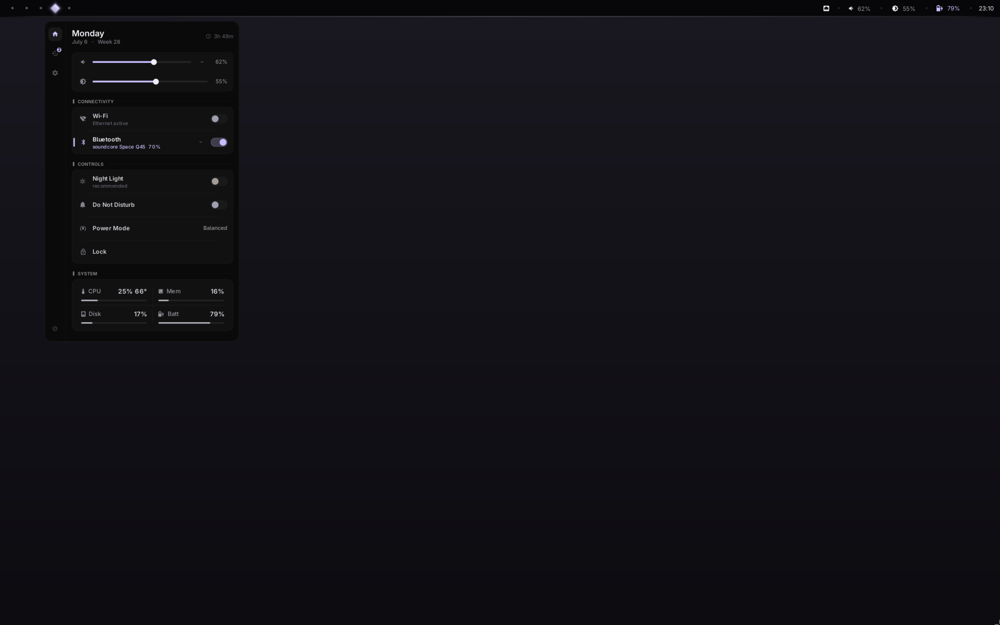

<p align="center">
  
</p>

> *silere*, from Latin: to be silent.

A Quickshell shell for Hyprland. Most shells come pre-loaded. Silere starts quiet and you turn things on.

<p align="center">
  <a href="LICENSE"></a>
  <a href="https://quickshell.outfoxxed.me/"></a>
</p>

<p align="center">
  
</p>

---

**bar:** workspaces, clock, media, volume, brightness, battery, network, tray.

**menu:** control center with quick toggles, sliders, and a full settings UI.

**notifications:** native server with a popup stack, do-not-disturb, and history.

**theming:** wallpaper-based via [matugen](https://github.com/InioX/matugen), or set your own accent. night light included. optional [cava](https://github.com/karlstav/cava) visualizer.

---

## install

```bash
git clone https://github.com/s3rven/silere-shell
cd silere-shell
bash scripts/install.sh
```

The installer manages its own copy at `$XDG_CONFIG_HOME/silere-shell` (asking first, with a default you can override) — the clone above only exists to fetch and run this script, and can be deleted afterward. It seeds the cava and matugen configs, optionally installs JetBrainsMono Nerd Font, and wires autostart into the active Hyprland config (`hyprland.conf` or Lua). It reads the running session's `Hyprland --config` path, resolving relative paths against the compositor's working directory, and honours `SILERE_HYPR_CONFIG=/path/to/config` when you want to point it at a specific file. Existing files are backed up before they're touched. Uninstall uses the same config discovery and removes only Silere's marked blocks, leaving later edits intact.

Restart Hyprland once it's done, then sanity-check the setup:

```bash
bash scripts/check.sh   # verify deps + smoke launch
```

---

## first use

The bar is the only thing on screen by default. Everything below is a click away.

- **menu:** click the active workspace diamond, then **Settings** for appearance, widgets, behavior, and updates.
- **calendar:** click the clock. Scroll inside the calendar or use its arrows to change month; click the month label to jump back to today. Middle-click the clock to cycle date and seconds visibility.
- **bar:** click a workspace to switch; middle-click one to send the active window there. Scroll over volume or brightness to adjust, click volume to mute. Right-click tray icons for their menus.
- **updates:** **Settings → Updates** checks for and applies Silere updates. The installer can also enable a daily background check; it only raises a pending badge in the bar and never updates on its own.

Escape or a click outside closes any popup.

---

## dependencies

`git`, Hyprland, and a current Quickshell build (`qs`) are required. Silere imports Quickshell's Hyprland, Wayland layer-shell, Widgets, Io, Bluetooth, Mpris, Notifications, PipeWire, SystemTray, and UPower modules unconditionally, so a build that splits or disables any of them won't load. `bash scripts/check.sh` reports which modules are present and catches import failures at startup.

Everything else is per-feature. A missing tool hides or trims the widget it backs rather than blocking the shell, and service-backed features also need the service running.

| tool | feature |
|---|---|
| pipewire / wireplumber | audio |
| upower | battery status + warnings |
| networkmanager / nmcli | network |
| brightnessctl | brightness |
| inotify-tools | instant brightness + screenshot flash |
| cava | media visualizer |
| matugen | wallpaper theming |
| hyprsunset | night light |
| power-profiles-daemon | power profiles |
| checkupdates / apt / dnf / zypper / xbps-install | package update badge |

---

## performance

These are single-machine readings, not guarantees. Qt6 and Mesa versions, the widgets you enable, your GPU drivers, and the display count all move the numbers.

On one local Hyprland session with the installer's launch environment applied, a 10-second idle sample used **175 MB RSS / 101 MB PSS / 76 MB USS** in Quickshell, or **196 MB RSS / 106 MB PSS** including Silere's four watcher processes, at 0.8% CPU. RSS counts shared Qt and graphics mappings in full; PSS apportions them and USS is memory private to Silere, so PSS/USS are the useful numbers when comparing shells. Hardware and enabled features will change these results.

Measure the running checkout with `bash scripts/bench.sh 10`. It samples average/peak RSS, PSS, USS, the complete helper-process tree, CPU, threads, visualizer state, and whether the allocator tuning is active. It rejects samples if Quickshell restarts during the window instead of recording a misleading partial result.

The same setup without the installer's launch environment previously used about 316 MB RSS; the gap is jemalloc and EGL tuning written into the autostart line. The benchmark prints `allocator default` when that launch tuning is missing.

The cava visualizer is the one feature with a real CPU cost, and it scales with the framerate in `assets/cava.conf` (60 by default). It runs only while music is actually playing, drops to idle when you pause, and stops entirely when the screen blanks.

---

## troubleshooting

Run `bash scripts/check.sh` from the repository after install or a Quickshell update. It checks formatting, module imports, tools and services, notification-daemon ownership, the generated theme and config files, and finishes with a short smoke launch. A warning on an optional feature is informational; a `FAIL` on the smoke launch is the one that means a real compatibility problem.

For a startup error you can read directly, stop the running instance and run `qs -p shell.qml` from the repository inside a Hyprland session. `qs list --all` lists running instances. Re-running the installer repairs generated cava/matugen files and autostart wiring. If notifications never appear, check that no other daemon already owns `org.freedesktop.Notifications`.

---

## license

MIT © s3rven
