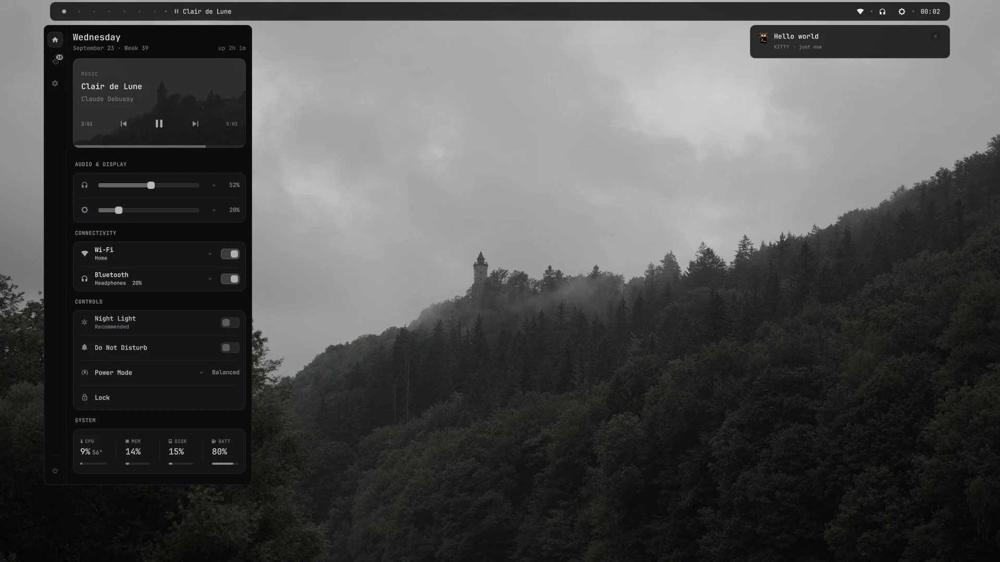
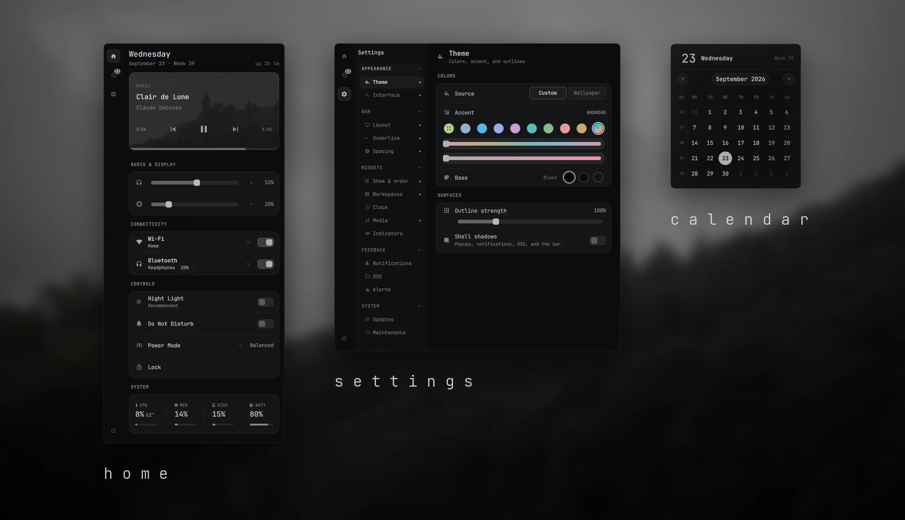

<p align="center">
  
</p>

<p align="center"><em>silere</em>, from Latin: to be silent.</p>

<p align="center">
  <a href="https://github.com/s3rven/silere-shell/releases"></a>
  <a href="LICENSE"></a>
  <a href="https://quickshell.org/"></a>
  
</p>

**Quiet by default.** A demand-driven Quickshell desktop shell for Hyprland and niri.
Nothing runs without a reason.

- **Demand-driven** — background work only runs when it has something to do.
- **Defensive** — broken backends, malformed input, and missing tools stay contained instead of taking the shell down.
- **Verified updates** — signed releases, pre-install validation, startup smoke tests, and rollback.

<p align="center">
  
</p>

## What you get

- **Bar**: workspaces, media, network, volume, brightness, battery, clock, tray, updates. Drag them between left, centre and right; per-monitor. The centred window title is off until you turn it on under Settings › Widgets › Indicators.
- **Menu**: one panel of live controls, settings, notification history.
- **Notifications**: actions, images, history, quiet hours and source-window jumping.
- **Theming**: matugen from your wallpaper or a hand-picked accent, over three dark base tones.
- **Calendar** from the clock, **OSD** for volume and brightness, **quick actions** for night light, power profiles and airplane mode.

The menu, the calendar, quick actions and every setting are scriptable over IPC.

## Designed to stay idle

Idle use on a reference session measured **under 1% of one CPU core** and **95-110 MB PSS** shortly after start, settling near **120 MB** after an hour and staying there. An empty Quickshell panel doing nothing measured about **57 MB PSS** on the same machine, so much of that is the Qt and GPU driver floor rather than Silere.

CPU sits near zero when nothing is happening and rises with what is on screen: a playing track costs about four times idle, and the media visualizer costs more than everything else combined. Once the session goes idle, or the bar steps aside for the compositor overview, every animation stops on its own until you come back.

Silere defaults to Qt's elapsed-time animation driver. Qt otherwise moves regular
QML animations to a roughly 16 ms timer when the bar and a popup are visible as
separate windows, making a high-refresh display look like 60 Hz. The default is
overrideable: launch with `QSG_USE_SIMPLE_ANIMATION_DRIVER=0` to compare or work
around a driver-specific issue.

Results vary with hardware, drivers, and which widgets you enable. Measure your own checkout with `bash scripts/bench.sh 30`, where the number is how many seconds to sample. The report tracks open file descriptors too, so a leak shows up as a climbing number while everything else stays flat.

Cava is the main optional CPU cost, and only while the visualizer is on screen.
Silere creates its own temporary Cava profile at runtime, so it does not alter or
depend on your personal Cava configuration.

## Install

You need `git`, Hyprland or niri, and Quickshell 0.3 or newer.

```bash
git clone https://github.com/s3rven/silere-shell
cd silere-shell
bash scripts/install.sh
```

The installer checks every QML module Silere imports and names any that are missing. It puts a checkout in your XDG config directory, or another path you choose, backs up files before editing them, and asks before touching compositor autostart. It prints the final install path when it's done.

To start it, restart your compositor, or try it right away with `qs -p /that/path/shell.qml`.

Bootstrapping from a dotfiles script or a container? `SILERE_ASSUME_YES=1` answers the
`[Y/n]` prompts and installs to the default path. It still backs up every file it edits,
and still stops on a compositor it does not support.

Once it's running, **click the active workspace diamond** to open the menu and settings. That is the way in, so it is worth binding a key to it early — see [Keybinds and scripts](#keybinds-and-scripts).

To remove it, run `bash scripts/uninstall.sh` from the installed checkout. That clears autostart, theme, and update-timer integrations, but keeps the checkout, your settings, and the installed font.

<details>
<summary><b>Optional tools</b>, none of them required</summary>

<br>

Installing one turns on the matching feature. Skipping it hides that widget or marks it unavailable.

| tool | enables |
|---|---|
| `pipewire` + `wireplumber` | volume, output picker |
| `upower` | battery |
| `nmcli` | VPN name fallback (network and Wi-Fi use Quickshell directly) |
| `brightnessctl` | brightness |
| `hyprsunset` | night light |
| `matugen` | wallpaper theming |
| `cava` | media visualizer |
| `powerprofilesctl` | power profiles |
| `inotifywait` | automatic screenshot-file watcher for underline feedback |
| `checkupdates` / `apt` / `dnf` / `zypper` / `xbps-install` | package update badge |
| `paru` / `yay` | AUR update count on Arch Linux |
| `hyprlock` | lock action |
| `systemctl` / `loginctl` | suspend, reboot, and shutdown actions |
| `notify-send` | battery, temperature, and update notifications |
| `ssh-keygen` | cryptographic verification of Silere release tags |

The installer also reports on `busctl`, `pgrep`, `pkill` and `timeout`. Those ship with systemd, procps and coreutils, so they are listed only so a minimal system can see what is missing.

</details>

The interactive installer configures Matugen when it is installed. It copies
Silere's template into Matugen's template directory and makes Matugen write
`$XDG_CONFIG_HOME/matugen/silere-shell.json`; the shell watches that user-writable
palette and reloads colors live. This works for both a Git checkout and a
read-only package under `/usr/share`. Packaged installs print the one-time
command that does the same thing, `install.sh --repair-matugen`.

Cava needs no configuration step. Silere writes a private temporary raw-output
profile under `$XDG_RUNTIME_DIR`, starts Cava only while the visualizer is
actually needed, and leaves `~/.config/cava` untouched.

## Configuration

<p align="center">
  
</p>

Everything is configurable from Settings inside the shell. Changes save on their own and apply without a restart.

Notification history keeps up to 20 entries by default. Under **Settings › Notifications › History**, you can change that limit or turn off **Keep after restart**; turning it off clears saved notification text and keeps new history only for the current session.

Overrides live in `$XDG_CONFIG_HOME/silere-shell/settings.json`, independent of where the checkout is. Only values that differ from their defaults are written, so the file stays short and readable. Calendar marks sit beside it in `calendar-marks.json`.

To restore defaults, use **Settings › System › Maintenance**. Editing the file by hand works too: delete a key to reset one option, or replace the whole file with `{ "__version": 1 }` to reset everything. Values are type-checked and numeric ranges are clamped on load, and a file Silere cannot read is left alone instead of overwritten.

When a release changes the settings format, the old file is copied to `settings.v<N>.bak.json` beside it before anything is migrated, and settings written by a newer version than you run keep their unknown values instead of being stripped.

## Controls

| area | actions |
|---|---|
| workspaces | click switches. On the active diamond, click opens the menu and right-click opens quick actions. Middle-click sends the focused window to that workspace. Scroll switches too, once you turn it on under Settings › Workspaces. |
| clock | click opens the calendar. Middle-click cycles seconds and date. |
| calendar | scroll changes the month. Click the header to jump back to today. |
| media | click plays or pauses. Scroll changes track. Middle-click jumps to the player. |
| volume | scroll changes volume. Click mutes. |
| brightness | scroll changes brightness. |
| tray | click jumps to the app. Right-click opens its menu. Middle-click runs the app's secondary action, and scrolling is passed through to the app. |
| notifications | click runs the default action. Right-click dismisses. Middle-click jumps to the app that sent it. |
| menu | Escape steps back, then closes. Click anywhere outside to close. |
| history | click an entry to read it in full. |

Silere is pointer-driven: Escape and the Wi-Fi password field are the only keyboard paths.

Shell and package updates never install on their own. Shell checks follow stable
version tags, accept only releases signed by Silere's bundled public verification
key, and show the pending commits before a two-step installation confirmation.
Signature verification proves where a release came from; it is not a claim that
the code is harmless. It protects continuity after the initial clone, which remains
the user's first trust decision. Package checks only update the badge and never
install packages.

## Keybinds and scripts

Every surface is scriptable over Quickshell IPC, so compositor keybinds and scripts can open them without simulating a click. Set `SILERE_DIR` to the path the installer printed.

```bash
SILERE_DIR="$HOME/.config/silere-shell"
qs ipc -p "$SILERE_DIR/shell.qml" call menu toggle
qs ipc -p "$SILERE_DIR/shell.qml" call menu tab 2
qs ipc -p "$SILERE_DIR/shell.qml" call menu settings updates
qs ipc -p "$SILERE_DIR/shell.qml" call calendar toggle
qs ipc -p "$SILERE_DIR/shell.qml" call quickActions toggle
qs ipc -p "$SILERE_DIR/shell.qml" call screenshot flash
qs ipc -p "$SILERE_DIR/shell.qml" call settings toggle reduceMotion
qs ipc -p "$SILERE_DIR/shell.qml" call settings set osdTimeout 3000
```

Menu tabs are `0` (Home), `1` (Settings), and `2` (Recent). `quickActions` holds Do Not Disturb, night light, power mode and airplane mode. `screenshot flash` lets a screenshot tool trigger the underline effect directly, without the optional filesystem watcher.

`menu`, `calendar` and `quickActions` each take `close` as well as `toggle`, for a keybind that dismisses without opening anything. Run `qs ipc -p "$SILERE_DIR/shell.qml" show` for the current list.

`settings` reads and writes any setting the Settings pages expose: `get`, `set`, `toggle`, `list [filter]`, and `modified`. A write echoes the value that landed, a rejected one names the values the key accepts, and `list` prints each key with its own range or vocabulary.

## Hooks

Silere runs a command of your own when something happens. Drop an executable file in `~/.config/silere-shell/hooks/`, named for the event:

| Hook | Arguments |
| --- | --- |
| `battery-critical` | percentage |
| `notification` | app name, summary, `critical` or `normal` |
| `theme-changed` | accent colour |
| `update-available` | count |
| `workspace-changed` | workspace id |

```bash
mkdir -p ~/.config/silere-shell/hooks
cat > ~/.config/silere-shell/hooks/battery-critical <<'EOF'
#!/bin/sh
notify-send "Battery at $1%"
EOF
chmod +x ~/.config/silere-shell/hooks/battery-critical
```

Hooks are read at startup; `qs ipc -p "$SILERE_DIR/shell.qml" call hooks rescan` picks up a new one without a restart, and `hooks list` shows which are active. An event with no executable file costs nothing.

Hook runs are capped at 20 a second, so a burst of notifications cannot spawn without limit. Anything past the cap is dropped rather than queued.

<details>
<summary>Settings section names for <code>menu settings &lt;name&gt;</code></summary>

<br>

`theme`, `interface`, `surface`, `underline`, `separators`, `widgets`, `workspaces`, `clock`, `media`, `indicators`, `popups`, `osd`, `warnings`, `updates`, `maintenance`

An unknown name falls back to `theme`, so an out-of-date keybind still opens Settings.

</details>

## Troubleshooting

From the Silere checkout, run the dependency and configuration checks first:

```bash
bash scripts/check.sh
```

To inspect startup errors directly, run `qs -p shell.qml`.

<details>
<summary>Common problems</summary>

<br>

**It installed but nothing appears.** Silere runs on Hyprland and niri only. On either of those it is nearly always the autostart line — run `qs -p ~/.config/silere-shell/shell.qml` to check. If the bar comes up, add that command to your compositor's startup (`exec-once` on Hyprland, `spawn-at-startup` on niri) and restart it.

**It stopped working after a system update.** A Qt update can leave the installed Quickshell unable to run, because it builds against Qt's private API. Reinstall Quickshell to rebuild it against the new Qt; `bash scripts/check.sh` reports this as its first failure.

**Notifications never appear.** Another daemon already owns `org.freedesktop.Notifications`. Silere works out which one and says so in an alert naming the process, a few seconds after start.

**Icons or text use the wrong font.** Install a Nerd Font such as `ttf-jetbrains-mono-nerd`, then refresh the user font cache.

**Text has coloured fringes on a fractionally scaled display.** Start Silere with `QSG_DISTANCEFIELD_ANTIALIASING=gray` in its environment.

**Brightness controls the wrong screen.** On hybrid laptops with several backlights, pick the right display under Settings › Interface.

**A shell update is blocked by local edits.** Preview them with `bash scripts/repair.sh`. Running it with `--apply` saves the edits in a reversible Git stash and restores the shipped files; `--undo` restores the latest saved repair.

</details>

## Contributing

Ideas, fixes, and new features are all welcome. See [CONTRIBUTING.md](CONTRIBUTING.md) to get started.

Forking or making it your own? [`docs/forking.md`](docs/forking.md) maps the tree, lists what a
change actually touches, and names the few things a rename has to get right.

## On AI assistance

I use AI tools to build Silere, and I think it makes the project better. It's just me
working on this. With the help, bugs get fixed the same day I find them instead of
sitting around for weeks.

I still decide what goes in, and I read every change myself. Silere is the only desktop
I use, so anything broken breaks my own machine first.

AI-assisted pull requests are welcome too. See [CONTRIBUTING.md](CONTRIBUTING.md).

## License

MIT (c) s3rven
