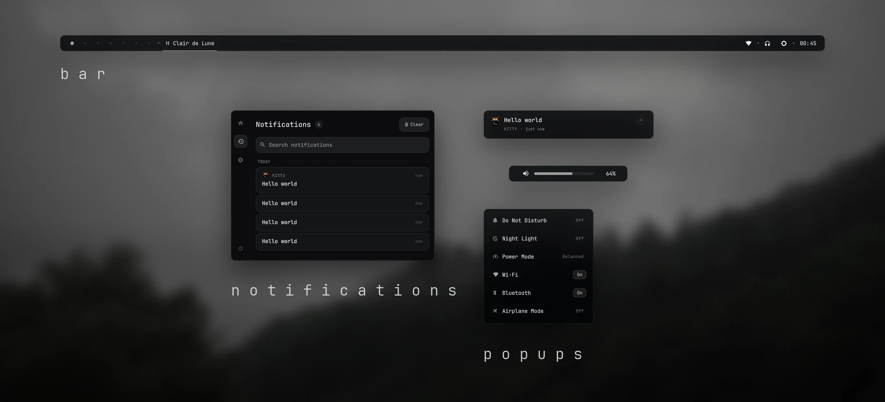
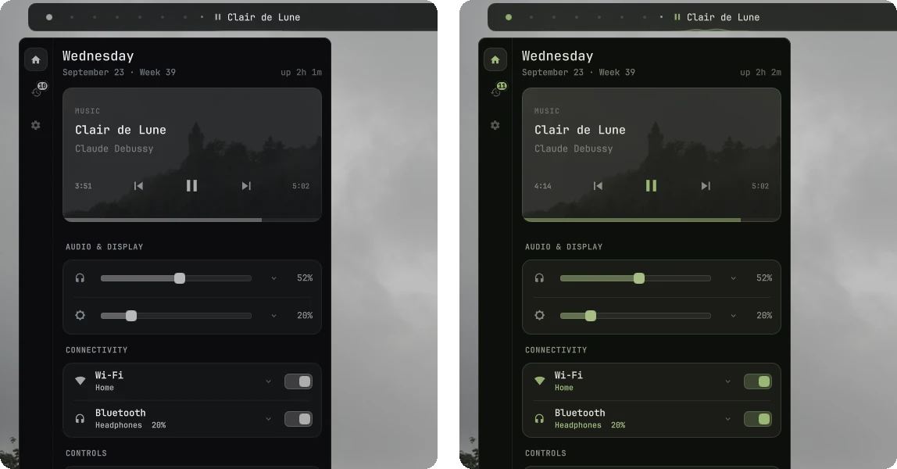

<p align="center">
  <picture>
    <source media="(prefers-color-scheme: light)" srcset="assets/banner-light.svg"/>
    
  </picture>
</p>

<p align="center"><em>silere</em>, from Latin: to be silent.</p>

<p align="center">
  <a href="https://github.com/s3rven/silere-shell/releases"></a>
  <a href="https://github.com/s3rven/silere-shell/actions/workflows/validate.yml"></a>
  <a href="LICENSE"></a>
  <a href="https://quickshell.org/"></a>
  
</p>

<p align="center">
  <a href="#install">Install</a> ·
  <a href="#what-you-get">Features</a> ·
  <a href="#controls">Controls</a> ·
  <a href="#scripting">Scripting</a> ·
  <a href="#performance">Performance</a> ·
  <a href="#checks">Checks</a> ·
  <a href="#docs">Docs</a>
</p>

Silere is a desktop shell for Hyprland and niri, built on Quickshell around one idea:
nothing runs without a reason.

Bar, menu, notifications, OSD, calendar and tray run in one process, at under 1% of a CPU
core while you are not touching it.

<p align="center">
  
</p>

## Why Silere

- **Work starts when there is work.** Every timer and poll runs only while something needs
  it, and animations end on their own once the session goes idle.
- **One process, not a stack.** No separate bar, notification daemon or OSD helper to
  install, theme, and keep in step with each other.
- **Settings live in the shell.** A panel with every option, applying the moment you
  change it — no restart, no reload.
- **Nothing third-party runs inside it.** There is no plugin system. Hooks run your own
  commands as separate, time-bounded processes.

## What you get

- **Bar** — workspaces, window title, media, network, bluetooth, volume, microphone,
  brightness, battery, clock, tray, package updates and shell updates. Drag them between
  left, centre and right; put the bar on the top or bottom edge, docked or floating.
- **Menu** — live controls, every setting, and notification history in one panel.
- **Notifications** — actions, images, inline replies, quiet hours, and a searchable
  history filtered by app. Middle-click one to jump to the app that sent it.
- **Theming** — Matugen from your wallpaper or a hand-picked accent, over three dark base
  tones, with background blur on Hyprland 0.56 and niri 26.04.
- **Calendar** from the clock, **OSD** for volume and brightness, and **quick actions** for
  do not disturb, night light, power mode and the radios.
- **More than one screen** — a bar on each one, switched off per screen, with
  notifications and the OSD following focus or kept on the display you choose.

<p align="center">
  
</p>

<p align="center">
  
</p>

The same page in the neutral theme and in colours Matugen took from the wallpaper:

<p align="center">
  
</p>

### What it leaves to you

Silere is the bar and the surfaces that open from it. It has no launcher, dock, lock
screen, wallpaper setter or clipboard history; keep the ones you already use. The lock
action runs hyprlock, swaylock, gtklock or a command of your own.

## Install

You need Hyprland or niri, Quickshell 0.3.1 or newer, and `git`.

```bash
git clone https://github.com/s3rven/silere-shell
cd silere-shell
bash scripts/install.sh
```

The checkout lands in `~/.config/silere-shell` unless you choose another path. The
installer backs up every file it edits and asks before adding autostart; `--dry-run` shows
the whole plan without writing anything. On Arch, `silere-shell-git` from the AUR installs
under `/usr/share/silere-shell` and updates through pacman.

Restart your compositor, or start Silere now with `silere run`. If you skipped the
`silere` command, that is `~/.config/silere-shell/scripts/silere run`.

**Opening the menu.** The installer offers to bind **Super + /** to the menu, which holds
every setting. Clicking the active workspace diamond opens it too. On niri, or a Hyprland
config in Lua, bind this yourself; niri runs it without a shell, so write out the full path:

```bash
qs ipc -p ~/.config/silere-shell/shell.qml call menu toggle
```

Volume, battery, brightness, night light and the other widgets appear when their tool is
installed. `silere doctor` lists what is missing and checks the install without changing
it. Fonts, optional tools, unattended installs, Matugen and removal:
[`docs/install.md`](docs/install.md).

## Controls

Silere is pointer-driven: Escape and text fields are its keyboard paths.

<details>
<summary>Every widget's controls</summary>


| area | pointer |
|---|---|
| workspaces | **click** switches · on the active diamond, **click** opens the menu and **right-click** opens quick actions · **middle-click** sends the focused window there · **scroll** switches too, once you turn it on under Settings › Widgets › Workspaces |
| clock | **click** opens the calendar · **middle-click** cycles seconds and date |
| calendar | **scroll** changes the month · **click** the header to jump back to today · **click** a date to mark it · choose week start and week numbers under Settings › Widgets › Clock |
| media | **click** plays or pauses · **scroll** changes track · **middle-click** jumps to the player |
| volume | **scroll** changes volume · **click** mutes · **middle-click** moves to the next output · **right-click** opens pwvucontrol or pavucontrol · in the menu, expand it for output, input and per-app levels |
| microphone | **click** mutes · **scroll** changes the input level · **middle-click** moves to the next input · **right-click** opens pwvucontrol or pavucontrol · it appears while an app is listening |
| brightness | **scroll** changes brightness |
| updates | **click** rechecks for packages |
| shell update | **click** opens Settings › System › Updates |
| tray | **click** jumps to the app's window, or activates the app when it has none · **right-click** opens its menu · **middle-click** runs the app's secondary action · **scroll** is passed through to the app |
| notifications | **click** runs the default action · **right-click** dismisses · **middle-click** jumps to the app that sent it · a reply action opens an inline text field when the sender supports one |
| wi-fi list | **click** joins a saved network, or opens a password field for a personal one · **right-click** or **middle-click** a saved network twice to forget it, unless you are connected to it |
| bluetooth list | **click** pairs or connects · **right-click** or **middle-click** a paired device twice to forget it, unless it is connected |
| menu | **Escape** steps back, then closes · **click** anywhere outside to close |
| history | **type** in Search to find an app or message · **click** an entry to read it in full · **Clear** removes the visible results · **Escape** clears search, then closes |

</details>

## Configuration

Settings live in the shell and save themselves. If you want the file, it is
`$XDG_CONFIG_HOME/silere-shell/settings.json`, wherever the checkout sits, and it holds
only what differs from the defaults. Values are type-checked and numeric ranges clamped on
load, and a file Silere cannot read is left alone rather than overwritten.

To start over, use **Settings › System › Maintenance**, or replace the file with
`{ "__version": 1 }`. Deleting a single key resets that one option.

## Scripting

The menu, calendar, quick actions and settings are scriptable over Quickshell IPC, and Silere
can run an executable of your own on events like `battery-critical` or `workspace-changed`.

```bash
SILERE_DIR="$HOME/.config/silere-shell"    # /usr/share/silere-shell with the AUR package
qs ipc -p "$SILERE_DIR/shell.qml" call menu toggle
qs ipc -p "$SILERE_DIR/shell.qml" call calendar toggle
qs ipc -p "$SILERE_DIR/shell.qml" call quickActions dnd
qs ipc -p "$SILERE_DIR/shell.qml" call settings set osdTimeout 3000
```

`silere ipc menu toggle` is the same call without the path. The full IPC surface, the
settings page names, and hooks: [`docs/scripting.md`](docs/scripting.md).

## Updates

Nothing installs on its own. Shell updates follow stable tags, accept only releases signed
by the key bundled in the checkout, and show you the pending commits behind a two-step
confirmation. A signature proves where a release came from, not that its code is harmless.
Package updates only move the badge.

## Performance

Measured on a reference session, as proportional set size (PSS):

| state | memory |
|---|---|
| an empty Quickshell panel, for comparison | ~57 MB |
| Silere, before the menu is first opened | ~82 MB |
| Silere, after the menu has opened once | ~93 MB |

Much of that is the Qt and GPU driver floor rather than Silere, and idle CPU stays well
under 1% of one core. The first menu open loads code and caches that stay resident: a
one-time cost, not a leak.

Measure your own checkout with `bash scripts/bench.sh 30`, or `--warm` for the post-menu
number. Method, fonts and the animation driver: [`docs/performance.md`](docs/performance.md).
Per release: [`docs/perf-history.md`](docs/perf-history.md).

## Checks

Every push and pull request runs these in a clean Arch container, and a weekly run repeats
them against the latest Quickshell package:

| check | what it covers |
|---|---|
| lint | 75+ rule groups, among them the settings schema against every settings row, the reduce-motion gate on every animation, what the AUR package ships, shellcheck and actionlint |
| portability | the installer, updater and uninstaller, run against throwaway repositories |
| Quickshell modules | every QML module Silere imports is present in the packaged Quickshell |
| type check | every QML file compiled ahead of time, which resolves each import and type |
| logic probe | 550+ checks against the real services, from settings reloads to IPC answers and update parsing |
| surface build | every settings page and menu surface, with reduce motion, high contrast, every option on, the largest type and fractional scaling |
| settings sweep | 180+ setting changes applied under 50+ built surfaces, each watched for errors and runaway layout |
| layout fit | every menu label at the width it ships at, across the type scale |

`bash scripts/check.sh` runs the same suite locally, and adds a startup smoke test and a
build of every layer-shell panel.

## Troubleshooting

```bash
silere doctor
```

That checks dependencies, autostart and configuration without changing anything. A running
shell's log is in `qs log -p ~/.config/silere-shell/shell.qml --follow`. Common problems:
[`docs/troubleshooting.md`](docs/troubleshooting.md).

## Docs

| page | what's in it |
|---|---|
| [install.md](docs/install.md) | doctor/maintenance command, optional tools, Matugen, removal |
| [scripting.md](docs/scripting.md) | the IPC surface, settings over IPC, page names, hooks |
| [troubleshooting.md](docs/troubleshooting.md) | symptom by symptom, starting with `silere doctor` |
| [performance.md](docs/performance.md) | reference numbers, how to measure, fonts, the animation driver |
| [perf-history.md](docs/perf-history.md) | per-release numbers, reference machines, how to record a row |
| [forking.md](docs/forking.md) | the tree, what a change touches, what a rename has to get right |
| [releasing.md](docs/releasing.md) | maintainer notes: cadence, tags, AUR, key rotation |
| [CHANGELOG.md](CHANGELOG.md) | unreleased work, and every release archived under [docs/releases](docs/releases/) |

## Contributing

Ideas, fixes, and new features are all welcome. See [CONTRIBUTING.md](CONTRIBUTING.md) to
get started, and [Discussions](https://github.com/s3rven/silere-shell/discussions) for
questions. Forking or making it your own? [`docs/forking.md`](docs/forking.md) maps the
tree, lists what a change actually touches, and names the few things a rename has to get
right.

## On AI assistance

I use AI tools to build Silere, and I think it makes the project better. It's just me
working on this. With the help, bugs get fixed the same day I find them instead of sitting
around for weeks.

I still decide what goes in, and I read every change myself. Silere is the only desktop I
use, so anything broken breaks my own machine first.

AI-assisted pull requests are welcome too. See [CONTRIBUTING.md](CONTRIBUTING.md).

## License

MIT (c) s3rven
