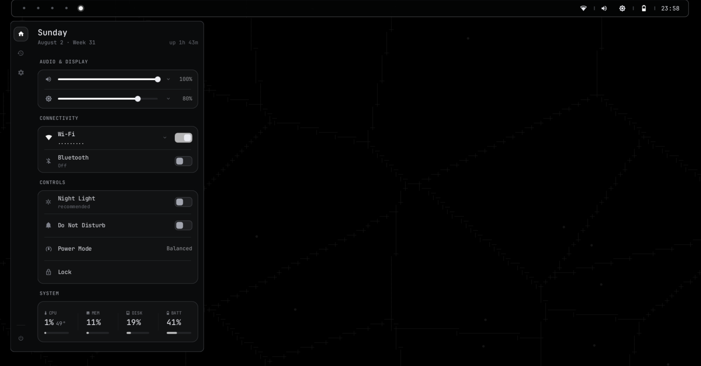

<p align="center">
  
</p>

<p align="center"><em>silere</em>, from Latin: to be silent.</p>

<p align="center">
  <a href="LICENSE"></a>
  <a href="https://quickshell.org/"></a>
  
</p>

Silere is a quiet Quickshell desktop shell for Hyprland and niri. It gives you a configurable bar, a control menu, notifications, and colors taken from your wallpaper or picked by hand.

Background features stay off until you turn them on. When a tool it relies on is missing, that one widget disappears and the rest of the shell keeps working. There is no plugin layer and no extra daemon.

<p align="center">
  
</p>

## Install

You need `git`, Hyprland or niri, and a current Quickshell build.

```bash
git clone https://github.com/s3rven/silere-shell
cd silere-shell
bash scripts/install.sh
```

The installer puts a checkout in your XDG config directory, or another path you choose. It backs up files before editing them and asks before touching compositor autostart, then prints the final install path.

To start it, restart your compositor, or try it right away with `qs -p /that/path/shell.qml`.

To remove it, run `bash scripts/uninstall.sh` from the installed checkout. That clears autostart, theme, and update-timer integrations, but keeps the checkout, your settings, and the installed font.

## Optional tools

Silere runs without any of these. Installing one turns on the matching feature. Skipping it hides that widget or marks it unavailable.

<details>
<summary>Full list of optional tools</summary>

| tool | enables |
|---|---|
| `pipewire` + `wireplumber` | volume, output picker |
| `upower` | battery |
| `nmcli` | VPN name fallback (network and Wi-Fi use Quickshell directly) |
| `brightnessctl` | brightness |
| `hyprsunset` | night light |
| `matugen` | wallpaper theming |
| `cava` | media visualizer |
| `powerprofilesctl` | power profiles |
| `inotifywait` | automatic screenshot-file watcher for underline feedback |
| `checkupdates` / `apt` / `dnf` / `zypper` / `xbps-install` | package update badge |
| `paru` / `yay` | AUR update count on Arch Linux |
| `hyprlock` | lock action |
| `systemctl` / `loginctl` | suspend, reboot, and shutdown actions |
| `notify-send` | battery, temperature, and update notifications |

</details>

## Controls

| area | actions |
|---|---|
| workspaces | click switches. On the active diamond, click opens the menu and right-click opens quick actions. Middle-click sends the focused window to that workspace. |
| clock | click opens the calendar. Middle-click cycles seconds and date. |
| calendar | scroll or arrow keys change the month. Click the header to jump back to today. |
| media | click plays or pauses. Scroll changes track. Middle-click jumps to the player. |
| volume | scroll changes volume. Click mutes. |
| brightness | scroll changes brightness. |
| tray | click jumps to the app. Right-click opens its menu. |
| menu | Escape steps back, then closes. Click anywhere outside to close. |
| history | click an entry to read it in full. |

Shell and package updates never install on their own; checks only update the badge, installing always takes a click.

## Keybinds and scripts

Every surface is scriptable over Quickshell IPC, so compositor keybinds and scripts can open them without simulating a click. Set `SILERE_DIR` to the path the installer printed; the usual default is below.

```bash
SILERE_DIR="$HOME/.config/silere-shell"
qs ipc -p "$SILERE_DIR/shell.qml" call menu toggle
qs ipc -p "$SILERE_DIR/shell.qml" call menu tab 2
qs ipc -p "$SILERE_DIR/shell.qml" call menu settings updates
qs ipc -p "$SILERE_DIR/shell.qml" call calendar toggle
qs ipc -p "$SILERE_DIR/shell.qml" call screenshot flash
```

Menu tabs are `0` (Home), `1` (Settings), and `2` (Recent). Settings sections are `theme`, `nightlight`, `surface`, `separators`, `underline`, `widgets`, `clock`, `workspaces`, `media`, `indicators`, `popups`, `osd`, `warnings`, `interface`, `updates`, and `maintenance`. `screenshot flash` lets a screenshot tool trigger the underline effect directly without the optional filesystem watcher.

## Configuration

Everything is configurable from Settings inside the shell. Changes save on their own and apply without a restart.

Overrides live in `$XDG_CONFIG_HOME/silere-shell/settings.json` (or `~/.config/silere-shell/settings.json`), independent of where the checkout is. Calendar marks sit beside it in `calendar-marks.json`. Only values that differ from their defaults are written, so the file stays short and readable.

To restore defaults, use Settings > System > Maintenance. Editing the file by hand also works: delete a key to reset one option, or replace the whole file with `{ "__version": 1 }` to reset everything. Values are type-checked and numeric ranges are clamped when the file loads. A file Silere cannot read is left alone instead of overwritten.

## Resource use

On a reference session, idle use measured under 1% of one CPU core and roughly 95–110 MB PSS. Results vary with hardware, drivers, and which widgets you enable. PSS is the more useful number for Qt applications because it apportions shared libraries.

Measure your own running checkout with `bash scripts/bench.sh 5`. Cava is the main optional CPU cost, and only while the visualizer is on screen.

## Troubleshooting

From the Silere checkout, first run the dependency and configuration checks:

```bash
bash scripts/check.sh
```

To inspect startup errors directly, run:

```bash
qs -p shell.qml
```

If a shell update is blocked by local checkout edits, preview them with `bash scripts/repair.sh`. Running `bash scripts/repair.sh --apply` saves the edits in a reversible Git stash and restores the shipped files; `--undo` restores the latest saved repair.

If notifications never appear, another daemon already owns `org.freedesktop.Notifications`.

If icons or text use the wrong font, install a Nerd Font such as `ttf-jetbrains-mono-nerd`, then refresh the user font cache.

On hybrid laptops with several backlights, pick the right display under Settings > Interface.

## Contributing

Ideas, fixes, and new features are all welcome. See [CONTRIBUTING.md](CONTRIBUTING.md) to get started.

## License

MIT (c) s3rven
