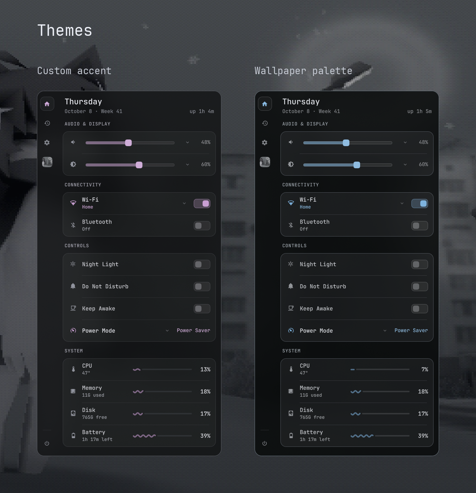

<p align="center">
  <picture>
    <source media="(prefers-color-scheme: light)" srcset="assets/banner-light.svg"/>
    
  </picture>
</p>

<p align="center">
  <a href="https://github.com/s3rven/silere-shell/releases"></a>
  <a href="https://github.com/s3rven/silere-shell/actions/workflows/validate.yml"></a>
  <a href="#performance"></a>
  <a href="LICENSE"></a>
  <a href="https://quickshell.org/"></a>
  
</p>

Silere is a quiet, lightweight desktop shell for **Hyprland** and **niri**, built with
**Quickshell**. It brings your bar, notifications, OSD, calendar, tray and everyday
controls together. Open the menu to adjust sound and brightness, connect devices,
control music and change the shell’s settings.

<p align="center">
  
</p>

## Quiet by default

A compact bar, subtle feedback and optional effects you choose
to turn on. The visualizer, network speed readings, clock seconds and underline effects
start switched off. System readings and animations pause when the session becomes idle.

- Arrange the bar and choose the widgets you need.
- Keep notifications in a searchable history, with actions and replies when apps support them.
- Use Now Playing for cover art, seeking, player switching, shuffle and repeat.
- Pick a custom accent or use your wallpaper's colours, with font, scale and motion settings.

<p align="center">
  
</p>

## Install

### 1. Install the prerequisites

You need a **Hyprland or niri session**, **git**, and **Quickshell 0.3.1 or newer**,
built against **at least Qt 6.9**. The one-line installer below also needs **curl**.

On Arch Linux:

```bash
sudo pacman -S --needed quickshell git curl
```

For other distributions, follow [Quickshell's install guide](https://quickshell.org/docs/v0.3.1/guide/install-setup/).

### 2. Install Silere

```bash
curl -fsSL https://raw.githubusercontent.com/s3rven/silere-shell/main/scripts/install.sh | bash
```

The installer offers fonts, autostart, the menu shortcut and a `silere` command.
It asks before editing your compositor config and backs up files it changes.
The default install is `~/.config/silere-shell`.

[Install from a clone, preview the changes, or choose another path](docs/install.md).

### 3. Start the shell

Stop your previous bar and notification daemon, then run:

```bash
silere run
```

If you skipped the command link, use `~/.config/silere-shell/scripts/silere run`.
Keep your preferred launcher, wallpaper tools and lock screen; choose the lock command
in **Settings › Appearance › Interface**.

## Use

| To open | Do this |
|---|---|
| Menu | Click the active workspace |
| Quick actions | Right-click the active workspace |
| Calendar | Click the clock |
| Now Playing | Right-click the media widget |

The installer offers **Super + /** as a menu shortcut on Hyprland. Press **Escape**
to step back or close a popup. [All controls and shortcuts](docs/usage.md).

### Make it yours

Open **Settings** to change the bar layout, colours, font, scale and motion. Changes
apply immediately. Choose a custom accent or use a wallpaper palette through Matugen.

<p align="center">
  
</p>

### Updates and recovery

**Settings › System › Overview** holds updates, diagnostics and restore defaults.
Silere verifies release signatures and asks for confirmation before installing from
the menu. [Updating and rolling back](docs/usage.md#updates).

<details>
<summary>Config files and scripting</summary>

Preferences are saved to `~/.config/silere-shell/settings.json`, or your
`$XDG_CONFIG_HOME` path. Only changes from the defaults are stored.
To reset the file, replace its contents with `{ "__version": 1 }`.
[The scripting guide](docs/scripting.md) lists IPC calls and event hooks.

</details>

## Performance

On the reference machine, release **1.4.1** measured about **98 MB PSS** with the bar
and **106 MB** after opening the menu, with idle CPU under **1% of one core**.
Your hardware, fonts and enabled features affect the result.
[Measurements and benchmarking](docs/performance.md).

## Help

Start with `silere doctor` to check your setup. `silere log --follow` shows the log,
and `silere restart` restarts the shell.

[Common problems](docs/troubleshooting.md) · [Ask a question](https://github.com/s3rven/silere-shell/discussions) · [Report a bug](https://github.com/s3rven/silere-shell/issues/new?template=bug_report.yml)

| Guide | What you'll find |
|---|---|
| [Installation](docs/install.md) | Fonts, optional tools, autostart and removal |
| [Controls](docs/usage.md) | Widgets, settings and updates |
| [Scripting](docs/scripting.md) | IPC calls and event hooks |
| [Performance](docs/performance.md) | Measurements and benchmarking |
| [Changelog](CHANGELOG.md) | Changes and release history |

## Contributing

Fixes, ideas and documentation changes are welcome. See [CONTRIBUTING.md](CONTRIBUTING.md)
and [the code guide](docs/forking.md).

### On AI assistance

I use AI tools while building Silere. I review the changes and use the shell on my own desktop.
AI-assisted contributions are welcome too.

[MIT](LICENSE) © s3rven
