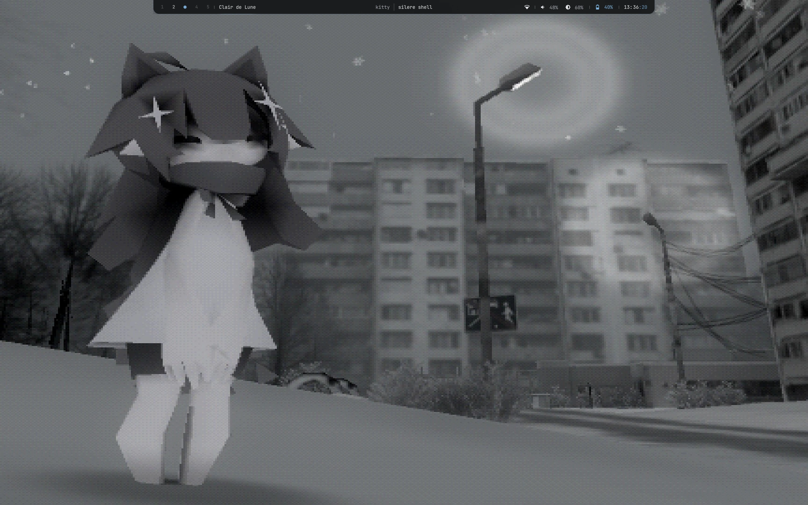
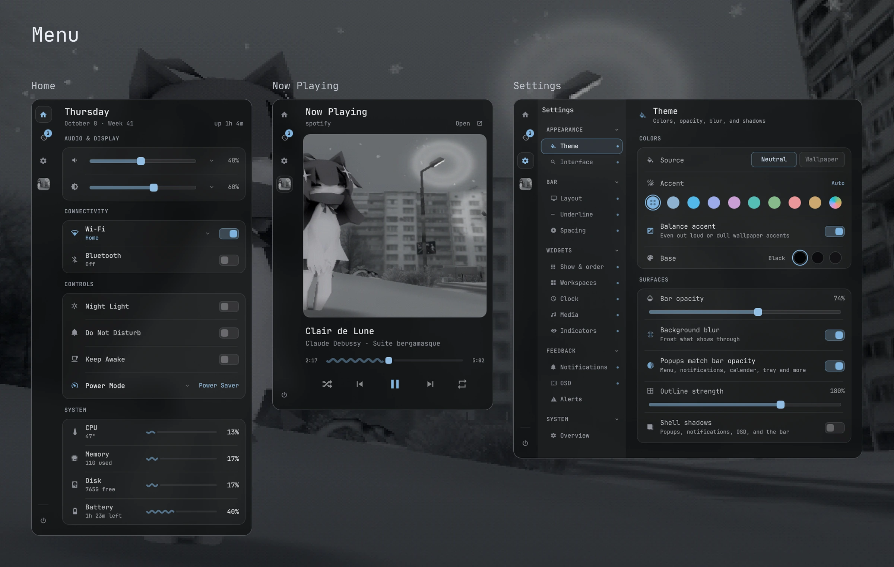
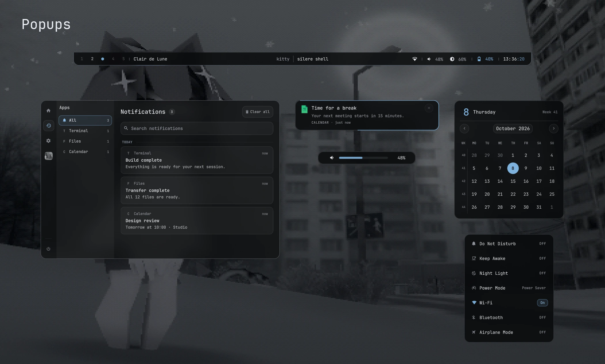
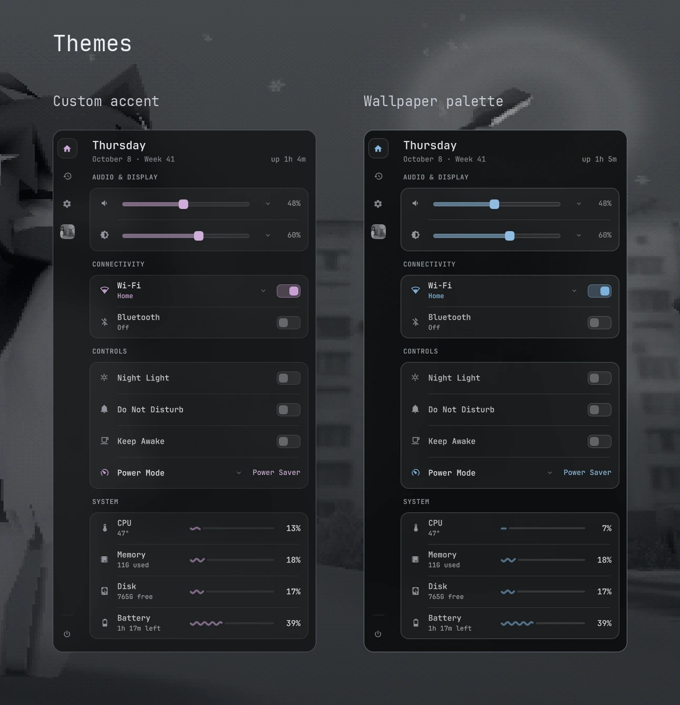

<p align="center">
  <picture>
    <source media="(prefers-color-scheme: light)" srcset="assets/banner-light.svg"/>
    
  </picture>
</p>

<p align="center">
  <a href="https://github.com/s3rven/silere-shell/releases"></a>
  <a href="https://github.com/s3rven/silere-shell/actions/workflows/validate.yml"></a>
  <a href="#performance"></a>
  <a href="LICENSE"></a>
  <a href="https://quickshell.org/"></a>
  
</p>

<p align="center">A desktop shell for Hyprland and niri that replaces your bar, notification daemon, OSD and tray.</p>

<p align="center">
  
</p>

Silere gives you a bar, notifications, an OSD, a calendar, a tray and a menu that holds
quick controls and every setting, all running in one Quickshell process. It's built to
cost almost nothing while you're not using it:

- It uses about 90 MB of memory and idles at well under 1% of one CPU core
  ([measurements](#performance)). After 10 minutes without input it also pauses its
  periodic readings and checks.
- The media visualizer, package update checks, network speed, temperature alerts, seconds
  on the clock and the underline effects all start switched off.
- Quickshell is the only package it needs to run. Night light, the visualizer and the
  underline's screenshot feedback start their helper programs only while they're on.

## Features

<details>
<summary>Bar, menu, notifications, OSD, calendar, night light, theming and more</summary>


- The bar can show workspaces, the focused window's title, what's playing, network,
  Bluetooth, volume, microphone, brightness, battery, the clock, the tray, and badges for
  package and Silere updates. It sits on the top or bottom edge, docked or floating, and
  Settings lets you drag its widgets between the left, centre and right. The network icon
  warns when the connection has no internet or is waiting at a sign-in page.
- The menu has three pages. Home holds media controls, volume and brightness, Wi-Fi and
  Bluetooth, night light, Do Not Disturb, keep awake, power mode, the lock button, and CPU,
  memory, disk and battery readouts. Settings holds every option, and the third page is your
  notification history. The Power button under the page buttons offers sleep, log out,
  reboot and power off; the last three need a second press.
- Notifications support actions, images, inline replies and progress bars. Do Not Disturb
  can follow a schedule, and the history can be searched, filtered by app and kept across
  restarts.
- The OSD shows volume, brightness and microphone mute, either as a popup or in the middle
  of the bar.
- Quick actions, opened by right-clicking the active workspace, switch Do Not Disturb,
  keep awake, night light, power mode, Wi-Fi, Bluetooth and airplane mode. Blocked radios
  and failed actions show an explanation beside their control.
- The calendar opens from the clock. It can show week numbers, start the week on Monday,
  Sunday or your locale's first day, and open an adjacent month when you click one of its dates.
- Night light uses hyprsunset on Hyprland and wlsunset on niri. In automatic mode it
  follows sunrise and sunset, estimated from your timezone instead of a location service.
- Colours come from your wallpaper through Matugen, or from an accent you pick, over three
  dark base tones. On Hyprland 0.56+ and niri 26.04+, a translucent bar blurs what's
  behind it.
- Settings include high contrast, reduced motion and interface scaling.
- With several screens, each one can have a bar or not, and notifications and the OSD
  either follow focus or stay on the screen you pick.

</details>

Silere doesn't include a launcher, dock, lock screen, wallpaper setter or clipboard
history, so keep the ones you already use. The lock button runs hyprlock, swaylock,
gtklock, `loginctl lock-session` or a command of your own.

<p align="center">
  
</p>

<p align="center">
  
</p>

<p align="center">
  
  <br/>
  <sub>Left: the neutral theme. Right: colours Matugen took from the wallpaper.</sub>
</p>

## Install

You need Hyprland or niri, `git`, and Quickshell 0.3.1 or newer, built against at least
Qt 6.9. On Arch, `sudo pacman -S --needed quickshell git` installs both. For other
distributions, see [Quickshell's install guide](https://quickshell.org/docs/v0.3.1/guide/install-setup/).

```bash
curl -fsSL https://raw.githubusercontent.com/s3rven/silere-shell/main/scripts/install.sh | bash
```

To read the installer first, clone the repository and run `bash scripts/install.sh` from it
instead. Add `-s -- --dry-run` after `bash` to see what it would change without writing anything.

The installer sets Silere up in `~/.config/silere-shell` unless you choose another folder,
backs up every file it edits and asks before adding autostart. It also offers to add a
`silere` command to `~/.local/bin` and to start Silere when it finishes, or you can run
`silere run` yourself. Without the command, use `~/.config/silere-shell/scripts/silere`
wherever this README says `silere`.

A widget that needs a tool you don't have stays hidden. `silere doctor` lists the missing
tools and checks the install, `silere log --follow` shows the log, and `silere restart`
restarts the shell. [docs/install.md](docs/install.md) covers fonts, optional tools,
unattended installs, Matugen and removal, and [docs/troubleshooting.md](docs/troubleshooting.md)
covers common problems.

## Usage

Open the menu by clicking the active workspace or with **Super + /**. The installer offers
to add that keybind on Hyprland, and prints it for you to add on niri or with a config
written in Lua. It runs:

```bash
qs ipc -p ~/.config/silere-shell/shell.qml call menu toggle
```

Everything else is done with the mouse. The keyboard is only used for Escape, Ctrl+F in
the notification history, and text fields.

<details>
<summary>Every widget's controls</summary>


| area | pointer |
|---|---|
| workspaces | **click** switches · on the active workspace, **click** opens the menu and **right-click** opens quick actions · **middle-click** sends the focused window there · **scroll** switches too, once you turn it on under Settings › Widgets › Workspaces |
| clock | **click** opens the calendar · **middle-click** cycles through adding seconds, the date, or both |
| calendar | **scroll** changes the month · **click** the header to jump back to today · **click** an adjacent-month date to open that month · choose week start and week numbers under Settings › Widgets › Clock |
| media | **click** plays or pauses · **scroll** changes track · **middle-click** jumps to the player |
| volume | **scroll** changes volume · **click** mutes · **middle-click** moves to the next output · **right-click** opens pwvucontrol or pavucontrol · in the menu, expand it for output, input and per-app levels |
| microphone | **click** mutes · **scroll** changes the input level · **middle-click** moves to the next input · **right-click** opens pwvucontrol or pavucontrol · it appears while an app is listening |
| brightness | **scroll** changes brightness |
| updates | **click** opens package details in Settings › System › Updates · **right-click** rechecks for packages |
| shell update | **click** opens Settings › System › Updates |
| tray | **click** opens a menu-only app's menu, otherwise jumps to its window or activates it · **right-click** opens its menu, with Hide from bar at the end · **middle-click** runs the app's secondary action · **scroll** is passed through to the app |
| notifications | **click** runs the default action · **right-click** dismisses · **middle-click** jumps to the app that sent it · a reply action opens an inline text field when the sender supports one |
| wi-fi list | **click** joins a saved or open network, or opens a password field for a personal one · **click** the connected network twice to disconnect · **right-click** or **middle-click** a saved network twice to forget it, unless you are connected to it |
| bluetooth list | **click** pairs or connects · **click** a connected device twice to disconnect · **right-click** or **middle-click** a paired device twice to forget it, unless it is connected |
| menu | **Escape** steps back, then closes · **click** anywhere outside to close |
| history | **type** in Search, or press **Ctrl+F** to get there, to find an app or message · **click** an app in the rail to show only its notifications · **click** an entry to read it in full · **Clear** removes what is shown, after a second click to confirm · **Escape** clears search, then closes |

</details>

## Settings and scripting

Every setting is in the menu and applies as soon as you change it. They're saved to
`~/.config/silere-shell/settings.json` (or under `$XDG_CONFIG_HOME`), which holds only what
you changed from the defaults.

To reset everything, use **Settings › System › Maintenance** or replace the file's
contents with `{ "__version": 1 }`. Deleting a single key resets that one setting.

Silere can also be scripted over Quickshell IPC, and it can run your own programs on
events such as `battery-critical` or `workspace-changed`:

```bash
silere ipc menu toggle
silere ipc calendar toggle
silere ipc quickActions dnd
silere ipc settings set osdTimeout 3000
```

Without the `silere` command, write `qs ipc -p ~/.config/silere-shell/shell.qml call`
followed by the same words. [docs/scripting.md](docs/scripting.md) lists every call, the
settings page names and the hooks.

## Updates

When a new release is out, Settings › System › Updates shows its release notes and
commits, and installs it after you press Install and then Confirm. Silere only accepts
release tags signed with the key that ships in your checkout, and `silere update --rollback`
returns to the version you had before.

Nothing installs on its own; the optional update timer only checks for releases. The
package badge in the bar counts pending system updates, and Silere never installs packages.

## Performance

Version 1.3.0 measured about 83 MB with only the bar drawn and 91 MB after opening the
menu, as PSS on the reference machine; your fonts and widgets change that. `btop` and `top`
show RSS, which also counts the Qt and graphics libraries every Qt app shares and reads
about twice as high. Idle CPU stays well under 1% of one core, and animations and the
visualizer use more while they run. [docs/performance.md](docs/performance.md) explains
how to measure your own setup.

## Documentation

- [install.md](docs/install.md): optional tools, fonts, Matugen, unattended installs, removal
- [scripting.md](docs/scripting.md): IPC calls, settings over IPC, page names, hooks
- [troubleshooting.md](docs/troubleshooting.md): symptom by symptom, starting with `silere doctor`
- [performance.md](docs/performance.md): how the numbers are measured, fonts, the animation driver
- [forking.md](docs/forking.md): the code layout, and what a change or a rename has to touch
- [CHANGELOG.md](CHANGELOG.md): changes since the last release, with older releases in [docs/releases](docs/releases/)

## Contributing

Pull requests of any size are welcome, from typo fixes to new widgets.
[CONTRIBUTING.md](CONTRIBUTING.md) has the details, and questions and ideas go in
[Discussions](https://github.com/s3rven/silere-shell/discussions).

## On AI assistance

I use AI tools to build Silere, and I think it makes the project better. It's just me
working on this. With the help, bugs get fixed the same day I find them instead of sitting
around for weeks.

I still decide what goes in, and I read every change myself. Silere is the only desktop I
use, so anything broken breaks my own machine first.

AI-assisted pull requests are welcome too. See [CONTRIBUTING.md](CONTRIBUTING.md).

## License

MIT © s3rven
